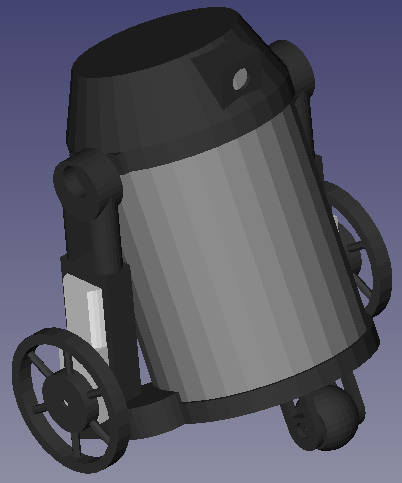
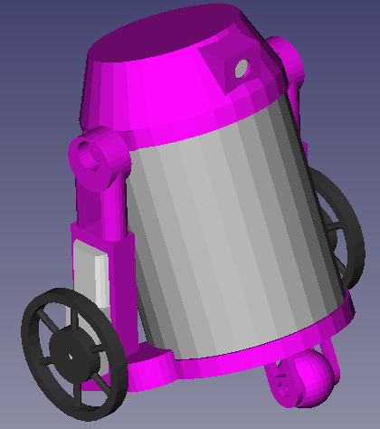

Simple tin can based, R2D2 like robot using a Parallax Propeller
sw@kaltpost.de
http://gpio.kaltpost.de/

Introduction
------------

Simple tin can based, R2D2 like robot using a Parallax Propeller. While the tin can is used as a body, 
all the parts around the can (bottom base, legs, dome, ...) are 3D printed. 

Usage
-----

The bot software is written in SPIN. Thus, a spin compiler is needed. If unsure how to get the toolchain,
have a look [here](http://gpio.kaltpost.de/?page_id=1378). For the supporting parts, STL and OpenSCAD 
files are provided to use with a 3D printer. 

Images
------

Full Robot, Black

Full Ronot, Pink

Exploded Ronbot

